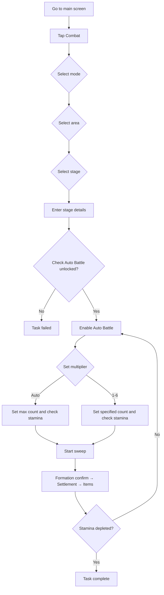

::: warning AI Translation Notice
This document was translated using AI. Please refer to the Chinese documentation for the definitive version.
:::

# Auto Sweep (自动刷本)

<Badge text="Experimental Feature" type="tip" />Farms stages using the in-game **自动战斗** (“Auto Battle”) feature.

Best for stages where 快速战斗 (“Quick Battle”) is already unlocked, allowing you to bulk-farm resources by setting a count or draining all stamina.

---

## What Does This Feature Do?

When you use **自动刷本** (“Auto Sweep”), MAK will automatically:

1. Enter the **出击** (“Combat”) page.
2. Navigate to the appropriate **stage mode** according to your settings: **资源收集** (“Resource Collection”) or **技能演练** (“Skill Training”).
3. Enter the appropriate **area** and swipe to select the **specific stage** you want to play.
4. Enable the stage's **自动战斗** (“Auto Battle”) feature.
5. Set the single sweep **count** to the maximum (drain stamina) or a specified value according to your settings.
6. Tap **开始扫荡** (“Start Sweep”), then complete formation confirmation, settlement, and item acquisition.
7. Repeat the sweep until **stamina is depleted** or the specified count is reached.

> Unlike **自动战斗** (“Auto Battle”), **自动刷本** relies on the in-game **自动战斗** feature, so the stage must have 快速战斗 (“Quick Battle”) unlocked (usually by clearing the stage with three stars).

---

## How Do I Configure It?

| Setting | Description |
|---------|-------------|
| **模式** (“Mode”) | Select the mode containing the stage: 资源收集 (“Resource Collection”) or 技能演练 (“Skill Training”) |
| **区域选择** (“Area Selection”) | Select the area containing the stage (only applies in 资源收集 (“Resource Collection”) mode) |
| **关卡选择** (“Stage Selection”) | Select the specific stage to play |
| **自动战斗倍率** (“Auto Battle Multiplier”) | Number of times to sweep per run: `自动` (“Auto”, set to max and drain stamina) or `1`–`6` (fixed count) |

---

## Currently Supported Content

### 资源收集 (Resource Collection)

| Area | Supported Stages |
|------|------------------|
| 特别军费行动 (Special Military Funding Operation) | 1-1、1-2、1-3、1-4、1-5 |
| 作战体能训练 (Combat Fitness Training) | 2-1、2-2、2-3、2-4 |
| 兵种能力评级 (Unit Capability Rating) | 3-1、3-2、3-3、3-4 |
| 载具对抗演练 (Vehicle Combat Drill) | 4-1、4-2、4-3、4-4、4-5 |

### 技能演练 (Skill Training)

> No specific stages have been adapted yet; support will be added in future versions.

---

## How It Works

---

## Notes

- Make sure the game is logged in before use.
- **Do not operate the emulator** while it is running.
- This feature depends on the in-game **自动战斗** (“Auto Battle”) feature and only works for stages where 快速战斗 (“Quick Battle”) is unlocked.
- In **自动** (“Auto”) mode, when stamina is insufficient the count is decreased automatically until the count reaches 1 and is still insufficient.
