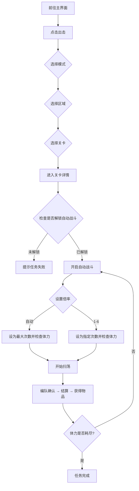

# 自动刷本

<Badge text="实验性功能" type="tip" />使用游戏内「自动战斗」功能快速刷本。

适用于已解锁快速战斗的关卡，通过设置次数或清空体力批量获取资源。

---

## 这个功能会做什么？

当你使用「自动刷本」功能时，MAK 会自动：

1. 进入**出击**页面
2. 根据你的设置，导航到对应的**关卡模式**（资源收集 / 技能演练）
3. 进入对应的**区域**，滑动选择你要打的**具体关卡**
4. 打开该关卡的**自动战斗**功能
5. 根据你的设置，将单次扫荡**次数**设为最大值（清空体力）或指定次数
6. 自动点击「开始扫荡」，完成编队确认、结算、获得物品等步骤
7. 重复扫荡，直到**体力耗尽**或达到指定次数

> 与「自动战斗」不同，「自动刷本」依赖游戏内的「自动战斗」功能，需要该关卡已解锁快速战斗（通常需要三星通关）。

---

## 如何配置？

| 设置项 | 说明 |
|-------|------|
| **模式** | 选择关卡所在模式：资源收集 / 技能演练 |
| **区域选择** | 选择关卡所在区域（仅在资源收集模式下生效） |
| **关卡选择** | 选择具体要打的关卡 |
| **自动战斗倍率** | 单次扫荡执行次数：`自动`（设为最大次数，体力不足自动递减，直到清空体力）或 `1`~`6`（固定次数） |

---

## 当前支持的内容

### 资源收集

| 区域 | 支持关卡 |
|------|---------|
| 特别军费行动 | 1-1、1-2、1-3、1-4、1-5 |
| 作战体能训练 | 2-1、2-2、2-3、2-4 |
| 兵种能力评级 | 3-1、3-2、3-3、3-4 |
| 载具对抗演练 | 4-1、4-2、4-3、4-4、4-5 |

### 技能演练

> 当前尚未适配具体关卡，将在后续版本中逐步支持。

---

## 运行流程

---

## 注意事项

- 使用前请确保游戏已经登录游戏
- 运行过程中**不要操作模拟器**
- 该功能依赖游戏内的「自动战斗」，仅对已解锁快速战斗的关卡生效
- 清空体力模式（`自动`）下，体力不足时会自动递减次数，直到次数为 1 仍不足才停止
